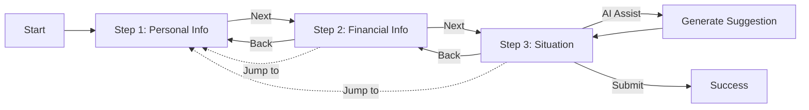

# CitizenCare Front-End

This project implements CitizenCare, a three-step application wizard for a government social support portal. Citizens can enter personal details, provide financial context, and receive AI-assisted help when describing their current situation. The interface is responsive, supports both English and Arabic (RTL) layouts, and persists progress locally so applicants can resume later.

## Features
- Three-step form with progress indicator and validation using React Hook Form + Material UI.
- Local storage persistence with auto-save (800ms debounce) and explicit **Save Progress** actions.
- AI assistance for narrative fields powered by OpenAI Chat Completions with editable suggestions and graceful error handling.
- Language toggle between English and Arabic, including RTL-aware theming and layout.
- Mobile-responsive design with optimized spacing, shadows, and adaptive UI elements.
- Country-based phone validation with dynamic placeholders and currency display (USD/AED).
- Location cascading dropdowns (Country → State → City) with proper data restoration.
- Accessible by default MUI components, keyboard-friendly navigation, and ARIA-conscious dialogs.


## Form Flow




## How It Works

The form walks users through three steps. Your progress saves automatically as you type, so you can close the browser and come back later.

**Step 1: Personal Info**
Basic stuff like name, national ID, birth date, and contact details. Phone validation adapts to your selected country, so it knows what's valid for a US number versus a UAE number.

**Step 2: Family & Financial**
Marital status, number of dependents, employment situation, monthly income, and housing status. Pretty straightforward dropdowns and number inputs.

**Step 3: Situation Descriptions**
This is where you explain your financial situation, employment circumstances, and why you're applying. Each field has a "Generate with AI" button if you want help writing it. The AI looks at your info from step 2 to make the suggestion more relevant. You can edit what it gives you, and if you don't like it, just hit the refresh button to try again with your edits as context.

If something goes wrong (invalid API key, network timeout, etc.), you'll see a clear error message instead of the app crashing. Error boundaries catch any unexpected issues so the whole form doesn't break if one part has a problem.

## Prerequisites
- **Node.js 22.20.0** recommended (use `nvm use 22.20.0` if you have nvm installed).
- Note: Vite 7 requires Node.js 20.19+ or 22.12+. You may see a version warning if using an older version, but the app will still function.
- npm 10+
- An OpenAI API key with access to the `gpt-3.5-turbo` model (or a compatible alternative).

## Installation
```bash
npm install
```

## Environment Variables

### Getting an OpenAI API Key
1. Visit [platform.openai.com](https://platform.openai.com/) and sign up or log in
2. Navigate to [API Keys](https://platform.openai.com/api-keys) section
3. Click "Create new secret key"
4. Give it a name (e.g., "CitizenCare Dev") and copy the key immediately (you won't be able to see it again)
5. Note: You'll need to add billing information and purchase credits to use the API. The app uses `gpt-3.5-turbo` which is cost-effective.

### Setting Up Your Environment
1. Copy `.env.example` to `.env`:
   ```bash
   cp .env.example .env
   ```

2. Open `.env` and add your OpenAI API key:
   ```
   OPENAI_API_KEY=sk-proj-...your-key-here...
   ```

3. Save the file and restart the dev server if it's running.

**Important Notes:**
- The key is read on the client only when an applicant requests AI assistance using the "Help Me Write" feature.
- Errors (missing key, timeouts, API failures) are surfaced in the UI with friendly messaging.
- For production deployments, consider moving API calls to a backend to protect your API key.
- The app will work without an OpenAI key, but the AI assistance features will be disabled.

## Development
```bash
# If you have nvm installed, use the recommended Node version first:
nvm use 22.20.0

# Then start the dev server:
npm run dev
```

The app is served by Vite and supports hot module replacement. If you see Node.js version warnings in the console, they can be safely ignored as long as the server starts successfully.

## Production Build
```bash
npm run build
npm run preview
```

The build command compiles TypeScript and outputs a production bundle in the `dist` directory. `npm run preview` serves the built assets locally.

## Project Structure Highlights
- `src/contexts` — React contexts for form data and language preferences with localStorage persistence.
- `src/components/forms` — Form steps with validation, save actions, and AI assistance controls.
- `src/services/openai.ts` — Wrapper around OpenAI Chat Completions endpoint with timeouts and domain-specific prompts.
- `src/theme` — Theme factory and emotion cache configured for LTR/RTL support.
- `src/i18n` — English and Arabic translation resources initialised by react-i18next.

## Testing & QA Tips
- Run `npm run build` to ensure the TypeScript project compiles.
- Test `npm test` to run the Jest test suite.
- Use the language toggle to verify RTL layout adjustments and translated copy.
- Test mobile responsiveness by resizing the browser or using device emulation.
- Verify location dropdowns cascade properly (Country → State → City) and restore values when navigating back.
- Check phone number validation with different country formats and ensure placeholders update correctly.
- Confirm currency display (USD/AED) changes based on selected country in the financial step.
- Exercise the "Help Me Write" buttons with valid/invalid API keys to confirm success and error paths.
- Navigate between steps to confirm auto-saved and manually saved progress is restored correctly.